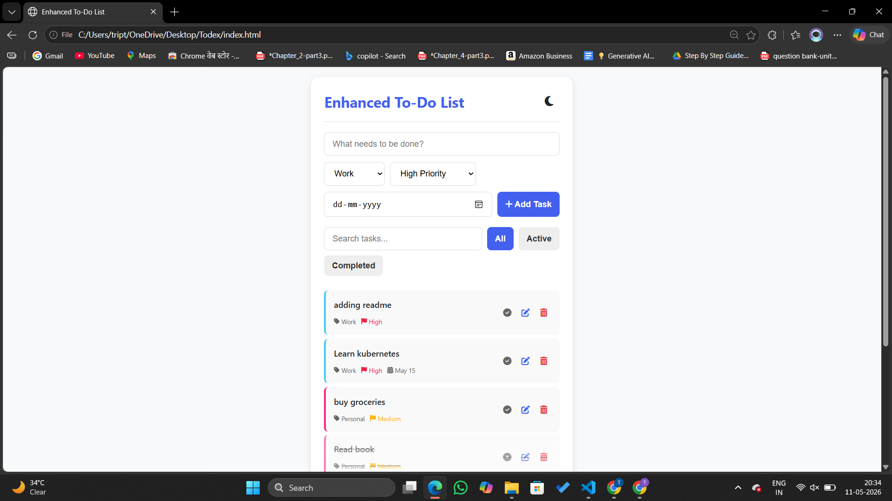
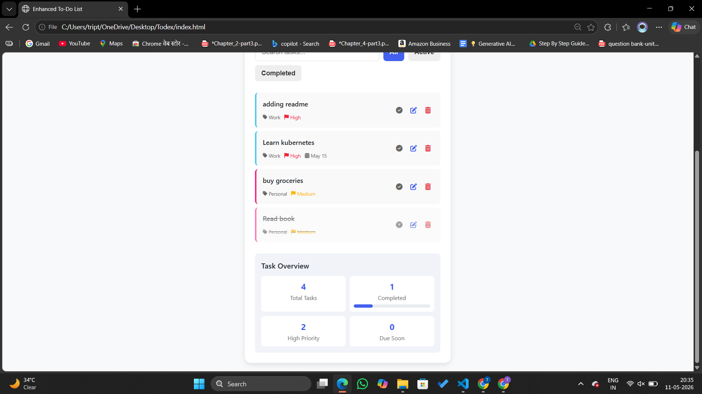
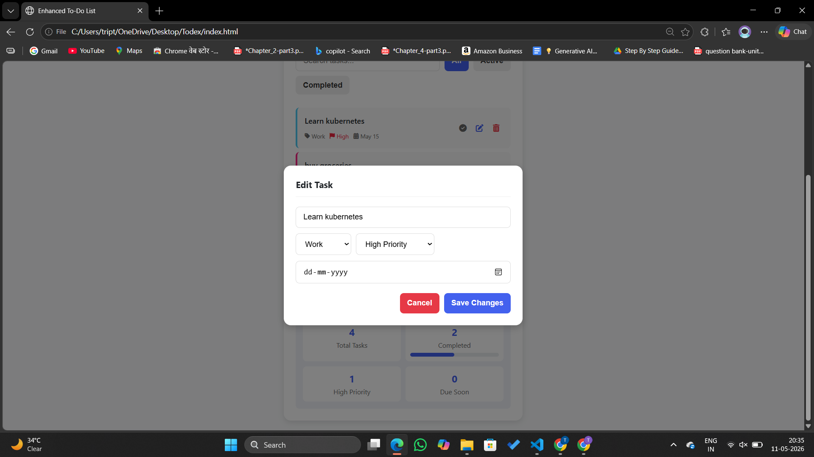
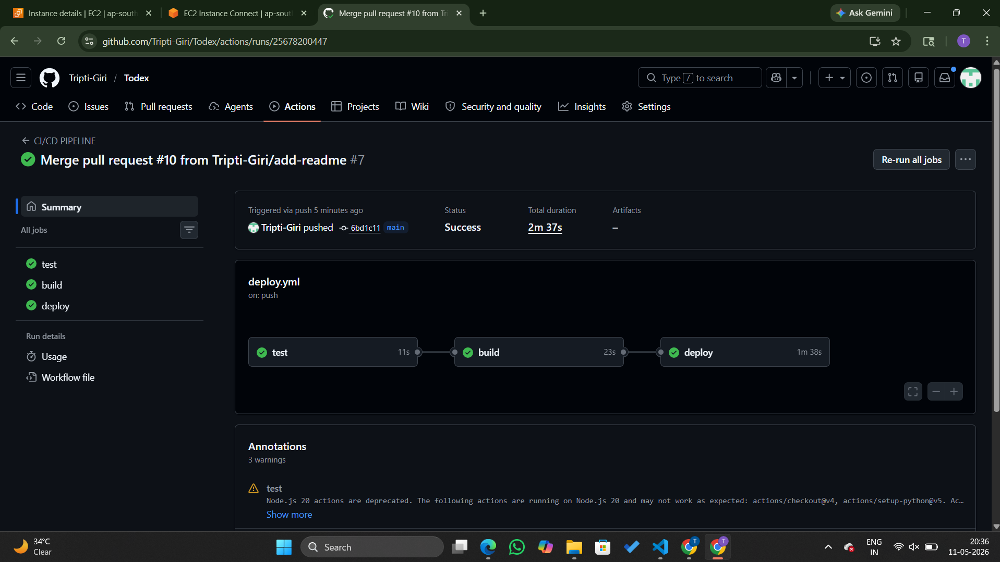
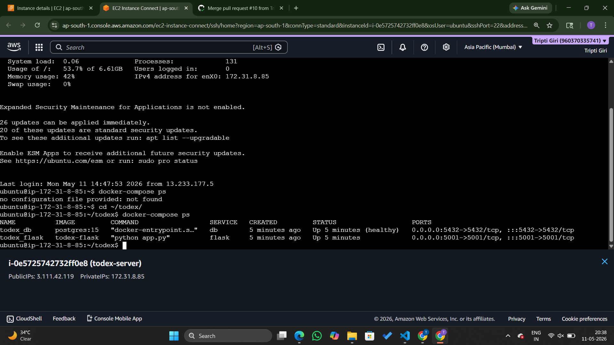
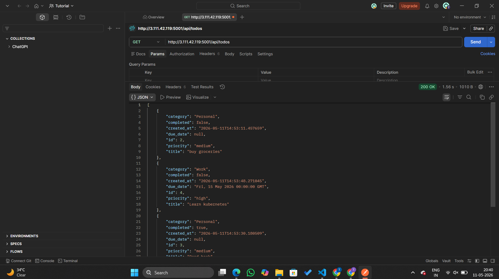

# Todex — Full Stack Todo Application

A production-grade todo application built with a Vanilla JS frontend,
Flask REST API, PostgreSQL database, Docker Compose, and automated
CI/CD deployment to AWS EC2 via GitHub Actions.

**Live API:** `http://3.111.42.119:5001/api/todos`
> ⚠️ EC2 instance is stopped to avoid AWS charges.
> To run locally, follow the [Running Locally](#running-locally) section below.
---

## Screenshots

### Task Dashboard




### GitHub Actions Pipeline — All 3 Jobs Green


### EC2 Running Containers


### API Response (Postman)


---

## Architecture

```
Browser (HTML/CSS/JS)
        ↓ REST API calls
Flask Backend (Python)      ← Docker Container (port 5001)
        ↓
PostgreSQL Database          ← Docker Container (port 5432)
        ↓
AWS EC2 (Ubuntu 26.04)      ← Production Server

GitHub Actions Pipeline:
Push to main → pytest → Docker build → DockerHub → EC2 deploy
```

---

## Tech Stack

-----------------------------------------------------------------
| Layer              |  Technology                              |
-----------------------------------------------------------------
| Frontend           | HTML5, CSS3, JavaScript (Vanilla)        |
| Backend            |  Python, Flask, Flask-SQLAlchemy         |
| Database           |  PostgreSQL 15                           |
| Containerization   |  Docker, Docker Compose                  |
| CI/CD              |  GitHub Actions                          |
| Cloud              |  AWS EC2 (Ubuntu 26.04, t2.micro)        |
| Image Registry     |  DockerHub                               |
| Testing            |  pytest (8 tests)                        |
| Version Control    |  Git, GitHub                             |
-----------------------------------------------------------------
---

## Features

- Create, read, update, delete todos
- Filter by priority, category, completion status
- Real-time search
- Task overview dashboard (total, completed, pending, due soon)
- Dark mode (persists via localStorage)
- Data persists across sessions via PostgreSQL
- Fully containerized with Docker Compose
- Automated CI/CD pipeline — push to main, app updates automatically

---

## Project Structure

```
Todex/
├── .github/
│   └── workflows/
│       └── deploy.yml       # GitHub Actions CI/CD pipeline
├── backend/
│   ├── app.py               # Flask application factory + all 5 routes
│   ├── models.py            # SQLAlchemy Todo model
│   ├── test_app.py          # pytest test suite (8 tests)
│   ├── requirements.txt     # Python dependencies
│   └── Dockerfile           # Flask container definition
├── images/                  # Project screenshots for README
├── docker-compose.yml       # Multi-container orchestration
├── index.html               # Frontend
├── script.js                # Frontend API integration
├── styles.css               # Styling
└── README.md
```

---

## API Endpoints

-----------------------------------------------------------------------------
| Method | Endpoint                    | Description          | Status Code |
|--------|-----------------------------|----------------------|-------------|
| GET    | `/api/todos`                | Get all todos        | 200         |
| GET    | `/api/todos?priority=high`  | Filter by priority   | 200         |
| GET    | `/api/todos?completed=true` | Filter by completion | 200         |
| POST   | `/api/todos`                | Create a todo        | 201         |
| PUT    | `/api/todos/<id>`           | Update a todo        | 200         |
| DELETE | `/api/todos/<id>`           | Delete a todo        | 200         |
| GET    | `/api/todos/stats`          | Get task counts      | 200         |
-----------------------------------------------------------------------------

### Example Request
```bash
curl -X POST http://3.111.42.119:5001/api/todos \
  -H "Content-Type: application/json" \
  -d '{"title": "Learn Docker", "priority": "high", "category": "Work"}'
```

### Example Response
```json
{
    "id": 1,
    "title": "Learn Docker",
    "category": "Work",
    "priority": "high",
    "due_date": null,
    "completed": false,
    "created_at": "2026-05-10T12:00:00"
}
```

---

## CI/CD Pipeline

Every push to `main` triggers an automated 3-stage pipeline:

```
Stage 1 — Test
--------------------------------------------------------------
  - Runs 8 pytest tests against SQLite in-memory DB
  - Blocks deploy if any test fails

Stage 2 — Build
--------------------------------------------------------------
  - Builds Docker image from backend/Dockerfile
  - Pushes to DockerHub (triptigiri/todex-flask:latest)

Stage 3 — Deploy
--------------------------------------------------------------
  - SSHs into AWS EC2
  - Pulls latest image from DockerHub
  - Restarts containers with zero downtime
```


---

## Production Deployment (AWS EC2)

The application runs on AWS EC2 (Ubuntu 26.04, t2.micro free tier).

### Infrastructure Setup
- EC2 instance with Security Groups configured for ports 22 (SSH) and 5001 (API)
- Docker and Docker Compose installed on EC2
- PostgreSQL data persisted via Docker named volumes
- Credentials stored in `.env` file on EC2 — never committed to GitHub
- All secrets (DockerHub token, EC2 SSH key) stored in GitHub Secrets

### How Deployment Works
```
GitHub Actions SSHs into EC2
        ↓
docker-compose down      ← stop old containers
docker-compose pull      ← pull latest image from DockerHub
docker-compose up -d     ← start updated containers in background
```

### Live Endpoints
```
GET  http://3.111.42.119:5001/api/todos
POST http://3.111.42.119:5001/api/todos
GET  http://3.111.42.119:5001/api/todos/stats
```
> ⚠️ EC2 instance currently stopped to manage AWS free tier costs.
> Start the instance and run `docker-compose up -d` to bring it back live.


---

## Data Persistence

Data is stored in PostgreSQL running as a Docker container with a named volume.

```yaml
volumes:
  - postgres_data:/var/lib/postgresql/data
```

### Survival Matrix

----------------------------------------------------------------------
| Event                        | Data Survives?                      |
|------------------------------|-------------------------------------|
| Flask container restart      | ✅ Yes                              |
| `docker-compose down` → `up` | ✅ Yes                              |
| EC2 reboot                   | ✅ Yes                              |
| `docker-compose down -v`     | ❌ No — volumes explicitly deleted  |
----------------------------------------------------------------------

### Where Data Lives on EC2
```
/var/lib/docker/volumes/todex_postgres_data/_data/
```

### Verify Persistence Yourself
```bash
# Add a todo
curl -X POST http://3.111.42.119:5001/api/todos \
  -H "Content-Type: application/json" \
  -d '{"title": "Persistence test"}'

# Restart containers
docker-compose down
docker-compose up -d

# Todo still exists ✅
curl http://3.111.42.119:5001/api/todos
```

---

## Running Locally

### Prerequisites
- Docker Desktop installed
- Git installed

### Steps

```bash
# Clone the repo
git clone https://github.com/Tripti-Giri/Todex.git
cd Todex

# Create .env file
echo "DATABASE_URL=postgresql://tripti:abcd123@db:5432/todex" > .env

# Start all services (Flask + PostgreSQL)
docker-compose up --build

# API running at:
http://localhost:5001/api/todos

# Open frontend:
Open index.html in your browser
```

### Run Tests Locally
```bash
cd backend
pip install -r requirements.txt
pytest test_app.py -v
```

Expected output:
```
test_get_todos_empty           PASSED
test_create_todo               PASSED
test_create_todo_missing_title PASSED
test_update_todo               PASSED
test_update_todo_not_found     PASSED
test_delete_todo               PASSED
test_delete_todo_not_found     PASSED
test_get_stats                 PASSED

8 passed
```

---

## Development Stages

This project was built incrementally across 4 stages:

| Stage | Branch | What was built |
|---|---|---|
| Stage 1 | `add-flask-backend` | Flask REST API with 5 endpoints |
| Stage 2 | `add-postgresql-stage2` | PostgreSQL database with SQLAlchemy ORM |
| Stage 3 | `add-dockerfile-stage3` | Docker + Docker Compose multi-container setup |
| Stage 4 | `add-cicd-stage4` | GitHub Actions CI/CD + AWS EC2 deployment |

---

## Author

**Tripti Giri**
- GitHub: [@Tripti-Giri](https://github.com/Tripti-Giri)
- LinkedIn: [tripti-giri](https://www.linkedin.com/in/tripti-giri-43789a281/)